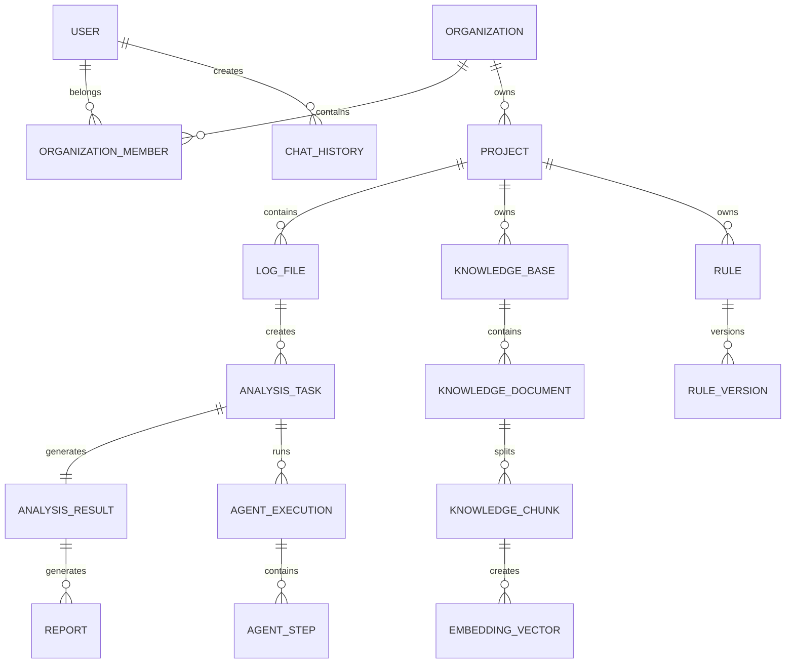

# Database Design Document

## AI Diagnostic Platform

Version: 1.0

---

# 1. 数据库设计目标

本数据库用于支撑：

- 用户管理
- 企业组织管理
- 项目管理
- 日志管理
- AI 分析任务
- 知识库管理
- RAG 检索
- Agent 执行
- Rule 规则
- 分析报告

设计目标：

1. 高扩展性
2. 支持多租户
3. 支持 AI 任务追踪
4. 支持知识沉淀
5. 支持未来商业化

---

# 2. 数据库技术选型

- 生产：PostgreSQL
- 辅助：Redis
- 对象存储：MinIO
- 向量：Milvus
- 搜索：Elasticsearch

---

# 3. 数据库架构

```
PostgreSQL
    |
    User
    |
    Organization
    |
    Project
    |
    Log
    |
    Analysis
    |
    Rule
    |
    Knowledge
    |
    Agent
    |
    Report
    |
    Vector Database
    |
    Knowledge Embedding
```

---

# 4. ER 总体关系图

使用 Mermaid：



---

# 5. 用户体系设计

USER 用户表。

用途：登录、权限、操作记录。

字段：

| 字段 | 类型 | 说明 |
| --- | --- | --- |
| id | UUID | 主键 |
| username | varchar | 用户名 |
| email | varchar | 邮箱 |
| password_hash | varchar | 密码 |
| avatar | varchar | 头像 |
| status | int | 状态 |
| created_at | timestamp | 创建时间 |

SQL：

```sql
CREATE TABLE users (
    id UUID PRIMARY KEY,
    username VARCHAR(64),
    email VARCHAR(128),
    password_hash TEXT,
    status INT DEFAULT 1,
    created_at TIMESTAMP
);
```

---

# 6. 企业组织模型

支持未来：企业版、多租户。

ORGANIZATION

字段：

| 字段 | 说明 |
| --- | --- |
| id | 组织 ID |
| name | 组织名称 |
| owner_id | 管理员 |
| created_at | 时间 |

ORGANIZATION_MEMBER

用户和企业关系。

字段：

| 字段 | 说明 |
| --- | --- |
| organization_id | 组织 ID |
| user_id | 用户 ID |
| role | 角色 |

role：

```
ADMIN
ENGINEER
TESTER
VIEWER
```

---

# 7. 项目管理模型

PROJECT

一个产品对应一个项目。

例如：智能座舱项目、机器人项目、网关项目

字段：

| 字段 | 说明 |
| --- | --- |
| id | 项目 ID |
| organization_id | 所属企业 |
| name | 项目名称 |
| description | 描述 |
| device_type | 设备类型 |
| version | 版本 |

示例：

- Project：智能终端 V2
- Device：SS528
- Version：1.0.3

---

# 8. 日志管理模型

LOG_FILE

保存日志文件信息。

字段：

| 字段 | 说明 |
| --- | --- |
| id | 日志 ID |
| project_id | 项目 |
| filename | 文件名 |
| size | 大小 |
| path | 存储路径 |
| upload_user | 上传人 |
| device_info | 设备信息 |
| created_at | 时间 |

LOG_EVENT

解析后的事件。

例如：

- 原始：ERROR USB timeout

转换：

```json
{
    "module": "USB",
    "level": "ERROR",
    "keyword": "timeout"
}
```

---

# 9. AI 分析任务模型

ANALYSIS_TASK

一次 AI 分析。

字段：

| 字段 | 说明 |
| --- | --- |
| id | 任务 ID |
| log_id | 日志 |
| user_question | 用户描述 |
| status | 状态 |
| model | 模型 |
| created_at | 时间 |

status：

```
PENDING
RUNNING
SUCCESS
FAILED
```

---

# 10. AI 分析结果

ANALYSIS_RESULT

保存 AI 输出。

字段：

| 字段 | 说明 |
| --- | --- |
| id | 主键 |
| task_id | 任务 |
| summary | 概述 |
| root_cause | 根原因 |
| confidence | 置信度 |
| solution | 解决方案 |
| evidence | 证据 |
| json_result | JSON 结果 |

例如：

```json
{
    "rootCause": "USB PHY timeout",
    "confidence": 0.92
}
```

---

# 11. 知识库设计

KNOWLEDGE_BASE

一个项目可以多个知识库。

例如：USB 知识库、Bluetooth 知识库、Kernel 知识库

字段：

| 字段 | 说明 |
| --- | --- |
| id | 知识库 ID |
| project_id | 项目 |
| name | 知识库名称 |
| type | 类型 |

---

# 12. 文档模型

KNOWLEDGE_DOCUMENT

来源文件。

例如：PDF：SS528_Datasheet.pdf

字段：

| 字段 | 说明 |
| --- | --- |
| id | 文档 ID |
| knowledge_base_id | 知识库 ID |
| filename | 文件名 |
| type | 类型 |
| source | 来源 |
| status | 状态 |

KNOWLEDGE_CHUNK

文档切片。

例如：PDF 100 页，拆为 500 个 chunk。

字段：

| 字段 | 说明 |
| --- | --- |
| id | 切片 ID |
| document_id | 文档 ID |
| content | 内容 |
| start_page | 起始页 |
| page | 页 |
| metadata | 元信息 |

---

# 13. Embedding 模型

EMBEDDING_VECTOR

保存向量索引。

字段：

| 字段 | 说明 |
| --- | --- |
| id | 向量 ID |
| chunk_id | 切片 ID |
| model | 模型 |
| vector_id | 向量 ID |

实际向量存储：Milvus。

---

# 14. Rule 规则系统

RULE

规则。

例如：USB_TIMEOUT

字段：

| 字段 | 说明 |
| --- | --- |
| id | 规则 ID |
| project_id | 项目 ID |
| name | 规则名称 |
| pattern | 模式 |
| priority | 优先级 |
| status | 状态 |

RULE_VERSION

规则版本。企业需要追踪。

字段：

| 字段 | 说明 |
| --- | --- |
| rule_id | 规则版本 ID |
| version | 版本 |
| content | 内容 |
| creator | 创建人 |
| created_at | 创建时间 |

---

# 15. Agent 执行模型

AGENT_EXECUTION

一次 Agent 运行。

例如：Log Agent 执行一次

字段：

| 字段 | 说明 |
| --- | --- |
| id | ID |
| task_id | 任务 ID |
| agent_name | Agent 名称 |
| status | 状态 |
| start_time | 开始时间 |
| end_time | 结束时间 |
| AGENT_STEP | Agent 步骤 |
| Agent | Agent |

每一步。例如：

- Step 1: Parse Log
- Step 2: Search Knowledge
- Step 3: Call LLM

字段：

| 字段 | 说明 |
| --- | --- |
| id | ID |
| execution_id | 执行 ID |
| step_name | 步骤名称 |
| input | 输入 |
| output | 输出 |
| duration | 持续时间 |

---

# 16. 报告模型

REPORT

分析报告。

字段：

| 字段 | 说明 |
| --- | --- |
| id | ID |
| analysis_id | 分析 ID |
| type | 类型 |
| content | 内容 |
| file_path | 文件路径 |
| created_at | 创建时间 |

支持：

- Markdown
- PDF
- Word
- HTML

---

# 17. Chat 模型

支持未来：AI 助手模式。

CHAT_SESSION 会话。

CHAT_MESSAGE 消息。

字段：

| 字段 | 说明 |
| --- | --- |
| id | ID |
| session_id | 会话 ID |
| user | 角色 |
| content | 内容 |
| ASSISTANT | 助手 |
| timestamp | 时间戳 |

---

# 18. 审计日志

企业必须有。

AUDIT_LOG

记录：谁什么时候做了什么。

字段：

| 字段 | 说明 |
| --- | --- |
| id | ID |
| user_id | 用户 ID |
| action | 动作 |
| resource | 资源 |
| ip | IP |
| timestamp | 时间戳 |

---

# 19. 数据生命周期

日志生命周期：

```
上传
↓
解析
↓
分析
↓
归档
↓
删除
```

知识生命周期：

```
上传
↓
审核
↓
发布
↓
版本管理
```

---

# 20. 数据扩展设计

未来支持：Bug 系统

增加：BUG_CASE

关联：

```
Analysis
↓
Bug
↓
Solution
```

自动训练数据

增加：TRAIN_DATASET

用于：LoRA 微调。

---

# 21. 数据库规范

命名：统一 snake_case

例如：

- analysis_task
- knowledge_document

规范：

- 主键：UUID
- 时间：UTC
- 软删除：deleted_at
- 版本：version 字段
